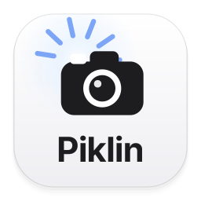
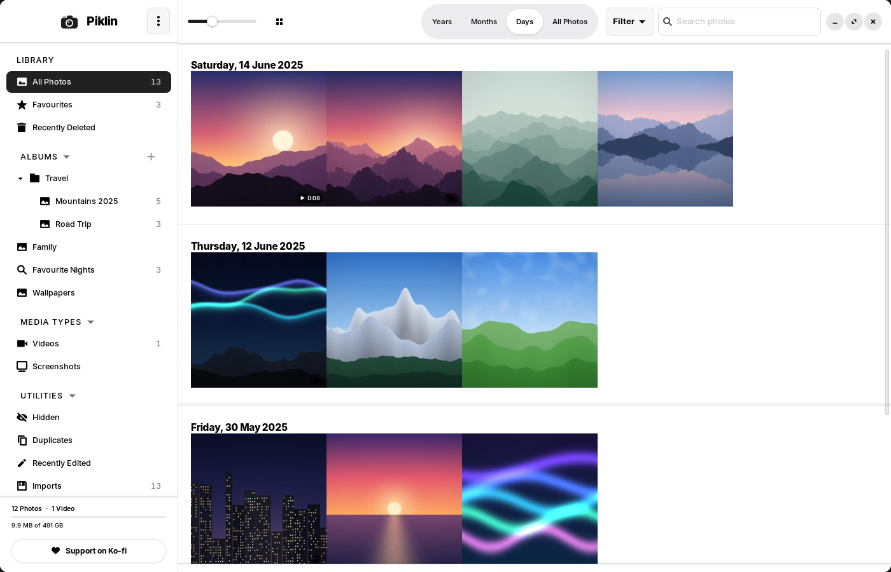
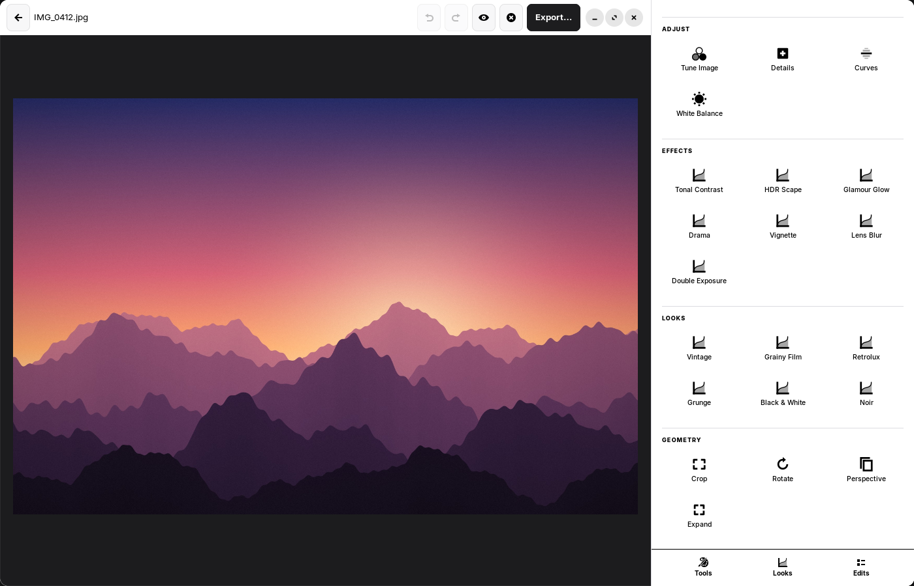
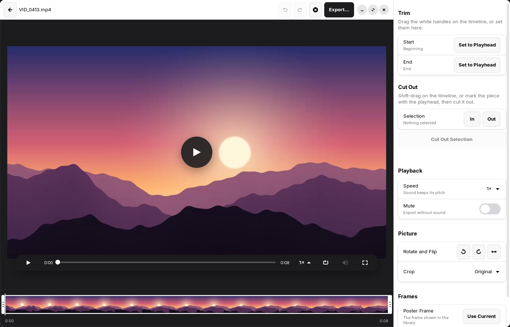

<p align="center">
  
</p>

<h1 align="center">Piklin</h1>

<p align="center">
  <strong>A free and private photo and video library for Linux and Mac.</strong><br>
  Organize, edit and share your memories. They never leave your computer.
</p>

<p align="center">
  <a href="https://github.com/vezzulab/Piklin/releases"></a>
  
  <a href="LICENSE"></a>
  <a href="https://ko-fi.com/vezzustudio"></a>
</p>

<p align="center">
  
</p>

## Features

### A library that stays yours

- **One package for everything.** Your library is a single `Piklin Library.piklin` package. Move it to another disk, copy it to a new computer and open it again.
- **Years, Months, Days or All Photos.** Filters and search cover favourites, videos, screenshots, location and more.
- **Albums, folders and smart albums.** Smart albums fill themselves from rules such as camera, date, rating, media type or video length.
- **Import from iPhones, iPads, cameras, cards and USB drives.** Connect one and it appears in the sidebar, ready to browse. Drag photos or whole folders from your desktop or file manager straight onto an album. Duplicates are recognised, and photos can be stored smaller without visible loss.
- **Useful views.** Recently Deleted keeps items for 30 days; Duplicates, Hidden and Imports are one click away.

### Editing without fear

- **28 professional tools and Looks.** Tune, curves, selective adjustments, healing, portrait tools and more.
- **Non-destructive.** Your original file is never changed, and every edit can be undone.
- **Quick fixes.** Rotate photos and videos in one click, and see your edits right in the thumbnails.
- **Export your way.** JPEG, WebP, AVIF or PNG, at the size you choose, with or without location and metadata.

<p align="center">
  
</p>

### Video, built in

- **Plays everything.** MP4, MOV, MKV, WebM, AVI, MTS and more, with sound, at speeds from 0.25× to 2× and frame by frame.
- **Previews in the grid.** Rest the pointer on a video and it plays silently.
- **Edit precisely.** Trim the ends, cut pieces out of the middle, rotate, flip, crop, change the speed or mute.
- **Save any frame** as a full-resolution photo.
- **Export** as MP4 (H.264), WebM (VP9) or an animated GIF, from 480p to 4K.
- **Live photos** appear as one item and play with a click.

<p align="center">
  
</p>

### Back up to your own server

Connect the place you want to back up to once. From then on, new photos, videos and edits are copied there automatically, a minute after they change. Nothing runs when nothing has changed, so it is easy on laptop batteries.

**Where your backup can go**

- **Any folder your computer can see.** A USB drive, a NAS such as QNAP or Synology (over SMB or NFS), or a folder kept in sync by a cloud app.
- **A NAS or server over WebDAV, built in.** QNAP, Synology, Nextcloud, ownCloud, pCloud, Box and any other WebDAV server, with nothing extra to install. Choose the backup folder from a list of the folders on your server.
- **Seventy-plus cloud services through [rclone](https://rclone.org).** Google Drive, OneDrive, Dropbox, Backblaze B2, S3, SFTP and more, using the rclone remotes you have already set up.

**What it does for you**

- **Only what changed.** A photo already backed up is never uploaded again unless it changes.
- **Previous versions.** When a file changes, its older copy stays in the backup for 7, 30 or 90 days.
- **Restore Missing Files.** Bring back only what is gone from your library, without replacing anything.
- **Safe by design.** Passwords are kept in your system keyring, never in a settings file, and backups never delete your photos.

### Private by design

- No accounts, no ads, no analytics, no telemetry.
- Photos, videos, edits and face detection stay on your computer.
- Piklin only goes online to back up to a destination you set up, and once a day to check whether a new version is out. You can turn that check off in Preferences.

## Install

Download from **[Releases](https://github.com/vezzulab/Piklin/releases/latest)**. Piklin updates itself afterwards, and your library, albums, edits and backups stay as they are.

### Linux

Download the `.deb` for your computer - `amd64` for most PCs, `arm64` for 64-bit ARM computers - and, in the folder where you saved it, run:

```bash
sudo apt install ./piklin_*_amd64.deb     # or ./piklin_*_arm64.deb
```

Piklin brings everything it needs for photos, video and sound. It uses your system's GTK 4 and libadwaita.

**Supported systems:** Ubuntu 24.04 or newer, Linux Mint 22 or newer, Debian 13 or newer, and distributions based on them, on 64-bit PCs (x86-64) and 64-bit ARM (arm64).

**Or try it without installing:** download the AppImage - `Piklin-<version>-x86_64.AppImage` for most PCs, `-aarch64` for ARM - then:

```bash
chmod +x Piklin-*.AppImage
./Piklin-*.AppImage
```

It carries its own GTK 4 and libadwaita and runs on Ubuntu 24.04, Linux Mint 22, Debian 13, Fedora 40 and newer. It updates itself like the `.deb`. For iPhones and cameras, the computer still needs `gvfs-backends` and `usbmuxd`.

### Mac

Download `Piklin-<version>.dmg`, open it and drag Piklin into Applications. One app works on Apple Silicon and Intel Macs with macOS 14 Sonoma or newer.

Piklin is not yet signed with an Apple Developer ID, so the first time you open it macOS asks whether to trust it: open **System Settings › Privacy & Security** and choose **Open Anyway** beside Piklin.

Your library is created in your Pictures folder the first time you open Piklin.

### iPhones and iPads

Connect the iPhone or iPad with a cable, unlock it, and choose **Trust** when it asks. It appears under Devices. On Linux this uses `gvfs-backends` and `usbmuxd`, which Ubuntu and Mint already have.

## Keyboard shortcuts

| Action | Keys |
|---|---|
| Years / Months / Days / All Photos | <kbd>Ctrl</kbd> + <kbd>1</kbd> … <kbd>4</kbd> |
| Open, or play and pause a video | <kbd>Space</kbd> |
| Edit | <kbd>Return</kbd> |
| Favourite | <kbd>.</kbd> |
| Rename | <kbd>F2</kbd> |
| Rotate right / left | <kbd>Ctrl</kbd> + <kbd>R</kbd> / <kbd>Ctrl</kbd> + <kbd>Shift</kbd> + <kbd>R</kbd> |
| Look for new photos | <kbd>F5</kbd> |
| Hide | <kbd>Ctrl</kbd> + <kbd>L</kbd> |
| Export | <kbd>Ctrl</kbd> + <kbd>E</kbd> |
| Search | <kbd>Ctrl</kbd> + <kbd>F</kbd> |
| Full screen | <kbd>F11</kbd> |
| Previous / next video frame | <kbd>,</kbd> / <kbd>.</kbd> (in a video) |
| Trim start / end at the playhead | <kbd>I</kbd> / <kbd>O</kbd> (video editor) |

## Build from source

You can build Piklin from source to run it on your own computers; see [License](#license) for what the license doesn't allow. On Ubuntu 24.04 or Linux Mint 22:

```bash
sudo apt install python3-venv python3-gi python3-gi-cairo gir1.2-gtk-4.0 gir1.2-adw-1 \
                 build-essential nasm meson ninja-build cmake patchelf pkg-config curl
python3 -m venv --system-site-packages .venv
.venv/bin/pip install numpy pillow pi-heif rawpy opencv-python-headless miniaudio auditwheel

packaging/build-media.sh      # builds FFmpeg and PyAV once, without GPL components
./run.sh                      # run from the source tree
packaging/build-deb.sh        # build the .deb in dist/
```

The `.deb` for either architecture can also be built in Docker, on Linux or a Mac:

```bash
packaging/build-deb-docker.sh arm64     # or amd64
```

On a Mac with Xcode, Homebrew (Apple Silicon, plus Intel Homebrew in `/usr/local` for the Intel half) and Rust:

```bash
brew install meson ninja cmake pkgconf nasm cargo-c bison itstool python@3.14
rustup target add x86_64-apple-darwin
packaging/build-macos.sh      # builds GTK, FFmpeg and Piklin.app for both processors, then dist/Piklin-<version>.dmg
```

## Support Piklin

Piklin is free. If it helps you, you can **[buy us a coffee on Ko-fi](https://ko-fi.com/vezzustudio)** ☕. It helps us keep improving Piklin.

Found a bug or have an idea? [Open an issue](https://github.com/vezzulab/Piklin/issues/new/choose).

## License

Piklin is © 2026 [Vezzu Studio](https://vezzu.studio) and is source-available under the **[Piklin License 1.0](LICENSE)**.

- You may use Piklin for free, at home or for work, including commercial use, on as many of your own computers as you like.
- You may read its source code.
- You may not modify, redistribute or sell Piklin or works based on it.
- Your photos, edits and everything you make with Piklin are yours.

Why its own license: Piklin installs updates by itself, so every copy should come from the official downloads, signed by Vezzu Studio. Repackaged copies from elsewhere can carry anything; the license keeps it simple: get Piklin from [GitHub](https://github.com/vezzulab/Piklin/releases) or [vezzu.studio](https://vezzu.studio), and use it however you like.

Third-party components keep their own licences; see [NOTICE.md](NOTICE.md).

Piklin and the Piklin logo are trademarks of Vezzu Studio.

---

<p align="center">Made with care by <a href="https://vezzu.studio">Vezzu Studio</a> in Boston.</p>
